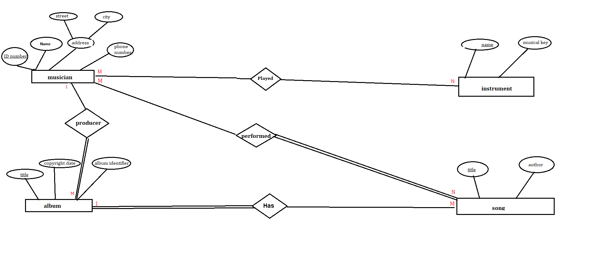
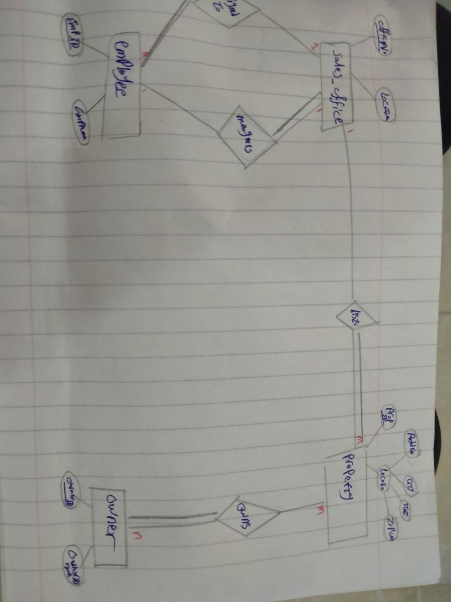
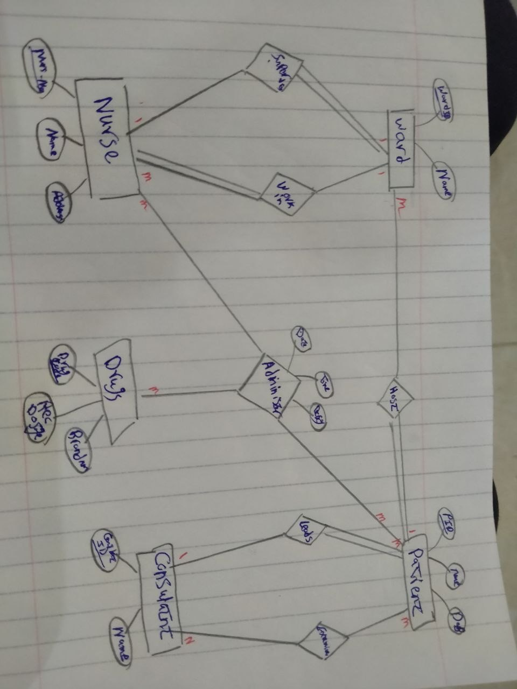
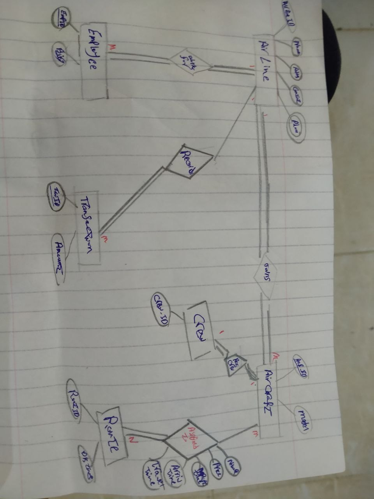

# Lab 1 — ER Diagram Design

Database Design Lab — ITI Summer Training
Design of conceptual (ER) schemas for four case studies: a music label, a real‑estate firm, a hospital, and an airline.

---

## Problem 1 — Musicana Records

**Requirements**
- Musician: ID (key), Name, Address (Street, City), Phone.
- Instrument: Name (key), Musical Key.
- Album: Title, Copyright Date, Album Identifier (key).
- Song: Title (key), Author.
- A musician can play several instruments; an instrument can be played by several musicians → **M:N** (`Play`).
- An album has many songs, but a song belongs to only one album → **1:N** (`Has`).
- A song can be performed by several musicians, and a musician can perform several songs → **M:N** (`Performed`).
- Each album has exactly one producer (a musician); a producer can produce several albums → **1:N** (`Producer`).

**Assumptions**
- `Address` is modeled as a composite attribute (Street, City).
- Album identifier is the primary key of Album (Title alone is unique but the identifier is used as the key per the requirement).

**ER Diagram**

---

## Problem 2 — Real Estate Firm

**Requirements**
- Sales Office: Office_Number (key), Location.
- Employee: Employee_ID (key), Employee_Name. Each employee belongs to exactly one office; an office has zero or more employees → **1:N** (`Works in`).
- Each office has exactly one manager, and a manager manages only one office at a time → **1:1** (`Manages`).
- Property: Property_ID (key), Location (Address, City, State, Zip_Code — composite attribute).
- Each property is listed by exactly one sales office; an office may list any number of properties (or none) → **1:N** (`Lists`).
- Owner: Owner_ID (key), Owner_Name. A property may have zero or more owners, and an owner may own one or more properties → **M:N** (`Owns`), with **Percent_Owned** as an attribute on the relationship.

**Assumptions**
- The `Manages` relationship is a 1:1 relationship between Employee and Sales Office (a manager is still an employee assigned to that office).

**ER Diagram**

---

## Problem 3 — General Hospital

**Requirements**
- Ward: Ward_ID (key), Name.
- Patient: Patient_ID (key), Name, Date_Of_Birth.
- A ward hosts many patients; a patient belongs to only one ward → **1:N** (`Hosts`).
- A patient has one leading consultant → **1:N** (`Assigned to`), but may be examined by several consultants, and a consultant may examine several patients → **M:N** (`Examines`).
- Consultant: Consultant_ID (key), Name.
- `Gives`: a ternary/associative relationship recording every time a Nurse gives a Patient a Drug, with Date, Time and Dosage as attributes.
- A ward is supervised by exactly one nurse, and a nurse supervises only one ward → **1:1** (`Supervises`).
- A nurse serves in exactly one ward; a ward can have many nurses → **1:N** (`Serves in`).
- Nurse: Nurse_ID (key), Name, Address.
- Drug: Code (key), Recommended Dosage, and one or more Brand names (multivalued attribute).

**ER Diagram**

---

## Problem 4 — Airline Company

**Requirements**
- Airline: ID (key), Name, Address, Contact Person, Phone numbers (multivalued).
- Employee: ID (key), Name, Address, Birthday (Day, Month, Year — composite), Gender, Position, Qualifications (multivalued). Each employee works for one airline; an airline has many employees → **1:N** (`Works in`).
- Aircraft: ID (key), Capacity, Model. Each aircraft belongs to one airline; an airline owns many aircraft → **1:N** (`Owns`).
- Route: ID (key), Origin, Destination, Distance, Classification.
- `Assigned`: M:N relationship between Aircraft and Route, with attributes Departure_DateTime, Arrival_DateTime, Number_of_Passengers and Price_per_Passenger (an aircraft can fly a route on different dates).
- Crew: (Major Pilot, Assistant Pilot, two Hostesses) — stored as attributes of Crew, not as separate Employee records. Each crew is assigned to exactly one aircraft → **1:1** (`Has`).
- Transaction: ID (key), Date, Description, Amount — each transaction (buy/sell) belongs to one airline → **1:N** (`Records`).

**ER Diagram**

