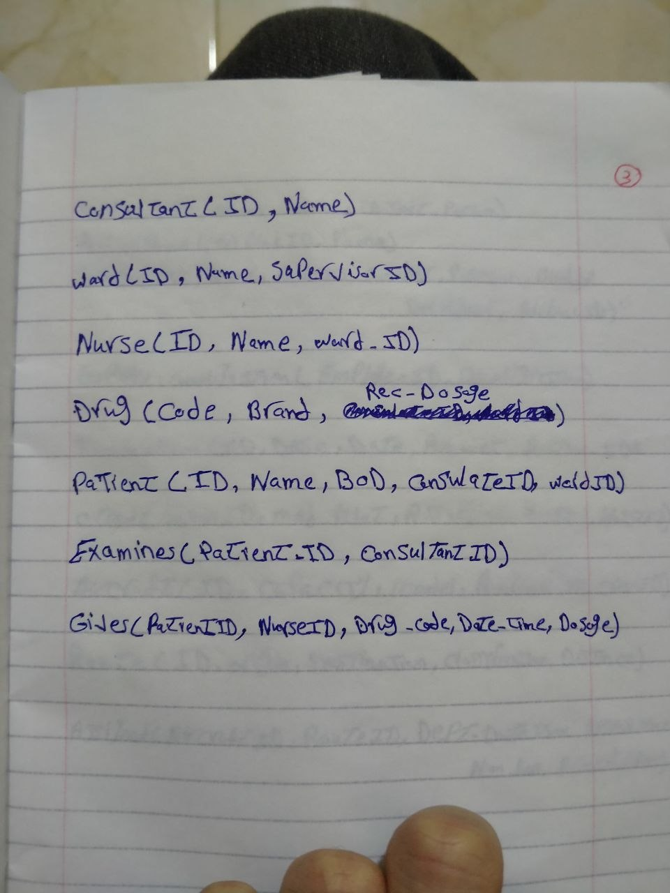

# Lab 2 — Mapping ER Diagrams to Relational Schema

Database Design Lab — ITI Summer Training
Mapping the ER diagrams from **Lab 1** into relational schemas (tables, keys, and foreign keys).

---

## Problem 1 — Musicana Records

```
Musician(ID, Name, Street, City, Phone)
Album(ID, Title, Date, Musician_ID*)                 -- Musician_ID: FK to Musician (producer)
Song(Title, Author, Album_ID*)                        -- Album_ID: FK to Album
Instrument(Name, Key)
Musician_Instrument(Musician_ID*, Instrument_Name*)   -- M:N (Play)
Musician_Song(Musician_ID*, Song_Title*)              -- M:N (Performed)
```

**Notes**
- `Album.Musician_ID` implements the 1:N `Producer` relationship.
- `Song.Album_ID` implements the 1:N `Has` relationship (a song belongs to one album).
- `Musician_Instrument` and `Musician_Song` are bridge tables created from the two M:N relationships (`Play`, `Performed`); each has a composite primary key made of the two foreign keys.

## Problem 2 — Real Estate Firm

```
Sales_Office(Num, Location, Manager_ID*)              -- Manager_ID: FK to Employee (1:1 Manages)
Employee(ID, Name, Office_Num*)                        -- Office_Num: FK to Sales_Office
Owner(ID, Name)
Property(ID, Address, City, State, Zip, Office_Num*)   -- Office_Num: FK to Sales_Office
Property_Owner(Property_ID*, Owner_ID*, Percent_Owned) -- M:N (Owns)
```

**Notes**
- `Employee.Office_Num` implements the 1:N `Works in` relationship.
- `Sales_Office.Manager_ID` implements the 1:1 `Manages` relationship (kept on the "one" side).
- `Property.Office_Num` implements the 1:N `Lists` relationship.
- `Property_Owner` is the bridge table for the M:N `Owns` relationship, carrying `Percent_Owned` as a relationship attribute.

**Reference (handwritten mapping)**


---

## Problem 3 — General Hospital

```
Consultant(ID, Name)
Ward(ID, Name, Supervisor_ID*)                          -- Supervisor_ID: FK to Nurse (1:1 Supervises)
Nurse(ID, Name, Ward_ID*)                               -- Ward_ID: FK to Ward (Serves in)
Drug(Code, Brand, Recommended_Dosage)
Patient(ID, Name, DOB, Consultant_ID*, Ward_ID*)        -- Consultant_ID: FK to Consultant, Ward_ID: FK to Ward
Examines(Patient_ID*, Consultant_ID*)                   -- M:N
Gives(Patient_ID*, Nurse_ID*, Drug_Code*, Date_Time, Dosage)  -- ternary relationship
```

**Notes**
- `Patient.Ward_ID` implements the 1:N `Hosts` relationship; `Patient.Consultant_ID` implements the 1:N `Assigned to` relationship (leading consultant).
- `Examines` is the bridge table for the M:N relationship between Patient and Consultant.
- `Nurse.Ward_ID` implements `Serves in` (1:N), while `Ward.Supervisor_ID` implements `Supervises` (1:1, one nurse per ward).
- `Gives` is a ternary relationship table (Patient, Nurse, Drug) carrying Date_Time and Dosage.

**Reference (handwritten mapping)**



---

## Problem 4 — Airline Company

```
Airline(ID, Name, Address, Contact_Person)
Airline_Phone(Airline_ID*, Phone)                       -- multivalued attribute -> own table
Employee(ID, Name, Address, Gender, Position, Birth_Day, Birth_Year, Airline_ID*)
Employee_Qualification(Employee_ID*, Qualification)     -- multivalued attribute -> own table
Transaction(ID, Description, Date, Amount, Airline_ID*)
Crew(Crew_ID, Major_Pilot, Assistant_Pilot, Hostess1, Hostess2)
Aircraft(ID, Capacity, Model, Airline_ID*, Crew_ID*)
Route(ID, Origin, Destination, Classification, Distance)
Assigned(Aircraft_ID*, Route_ID*, Departure_DateTime, Arrival_DateTime,
         Number_of_Passengers, Price_per_Passenger)     -- M:N
```

**Notes**
- Multivalued attributes (`Phone`, `Qualification`) are pulled out into their own tables, each keyed by the owning entity's key plus the value.
- `Employee.Airline_ID`, `Transaction.Airline_ID` and `Aircraft.Airline_ID` implement the three 1:N `Works in / Records / Owns` relationships.
- `Aircraft.Crew_ID` implements the 1:1 `Has` relationship (each aircraft has exactly one crew).
- `Assigned` is the bridge table for the M:N relationship between Aircraft and Route, carrying flight-specific attributes (an aircraft can fly the same route on different dates).

**Reference (handwritten mapping)**


